<div align="center">

# ⚡ ARP Poisoning — Man-in-the-Middle Attack

[](https://www.kali.org/)
[](https://www.ettercap-project.org/)
[](https://www.wireshark.org/)
[]()

<br/>

> Intercept all traffic between two victim machines by poisoning their ARP caches — making them route every packet through the attacker.

</div>

---

## 📋 Table of Contents
- [How ARP Poisoning Works](#-how-arp-poisoning-works)
- [Lab Setup](#-lab-setup)
- [Step-by-Step Walkthrough](#-step-by-step-walkthrough)
- [Results & Verification](#-results--verification)
- [Mitigation](#-mitigation)

---

## 🧠 How ARP Poisoning Works

```
NORMAL TRAFFIC FLOW:
  Win7 (135) ────────────────────────────► Win10 (136)

AFTER ARP POISONING:
  Win7 (135) ──► Kali/Attacker (129) ──► Win10 (136)
                      ▲
               All traffic intercepted
               here before forwarding
```

The attacker sends **forged ARP Reply** packets to both victims:
- To Win7: *"192.168.23.136 is at [Attacker MAC]"*
- To Win10: *"192.168.23.135 is at [Attacker MAC]"*

Both victims update their ARP cache with the wrong MAC, so all traffic passes through the attacker's machine.

---

## 🖥️ Lab Setup

| Role | Machine | IP Address | MAC |
|------|---------|-----------|-----|
| **Attacker** | Kali Linux | `192.168.23.129` (eth0) | `00:0C:29:D6:40:F4` |
| **Victim 1** | Windows 7 | `192.168.23.135` | `00:0C:29:7F:68:69` |
| **Victim 2** | Windows 10 | `192.168.23.136` | `00:0C:29:0B:98:0C` |
| **Network** | VMware Virtual | `192.168.23.0/24` | — |
| **Tool** | Ettercap | `0.8.4` | — |

---

## 🚀 Step-by-Step Walkthrough

### Step 1 — Verify IP Addresses on All Machines

Confirm all three machines are on the same subnet before launching the attack.

**Victim 2 — Windows 10**
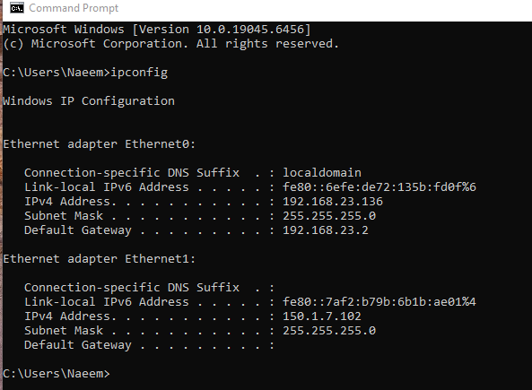
> Windows 10 — IP: `192.168.23.136` | Gateway: `192.168.23.2`

**Victim 1 — Windows 7**
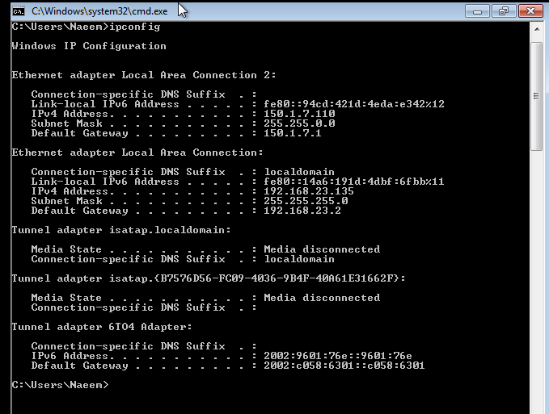
> Windows 7 — IP: `192.168.23.135`

**Attacker — Kali Linux**
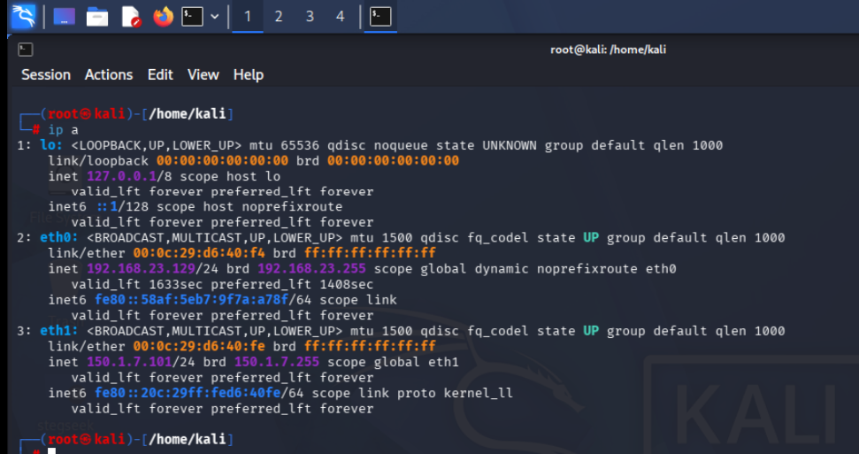
> Kali — `eth0: 192.168.23.129` | `eth1: 150.1.7.101`

---

### Step 2 — Verify Connectivity (Ping Tests)

All machines must be reachable from each other before the attack.

**Kali → Both Victims**
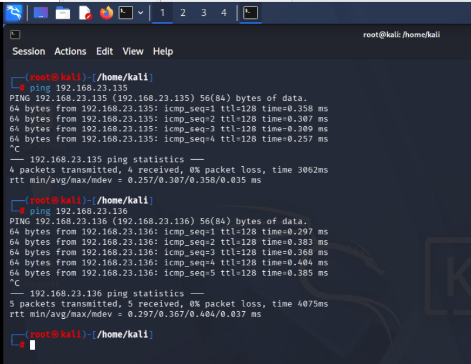
> Kali successfully pings Win7 (`.135`) and Win10 (`.136`)

**Win7 → Win10**
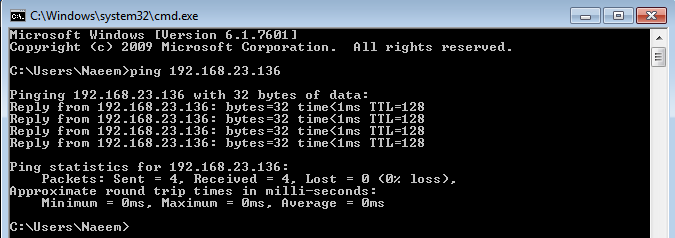

**Win10 → Win7**
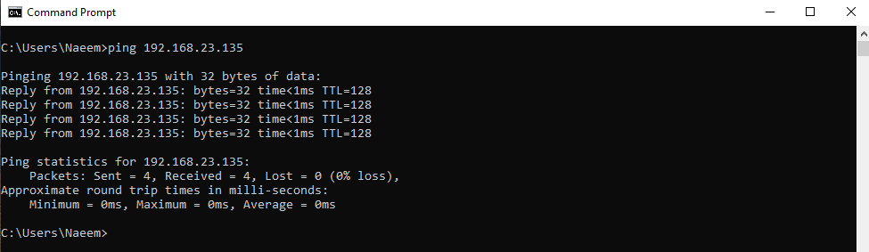

---

### Step 3 — Enable IP Forwarding on Kali

IP forwarding ensures that intercepted packets are still forwarded to the real destination — keeping the attack **stealthy** (victims maintain connectivity).

```bash
echo 1 | sudo tee /proc/sys/net/ipv4/ip_forward
cat /proc/sys/net/ipv4/ip_forward   # must output: 1
```

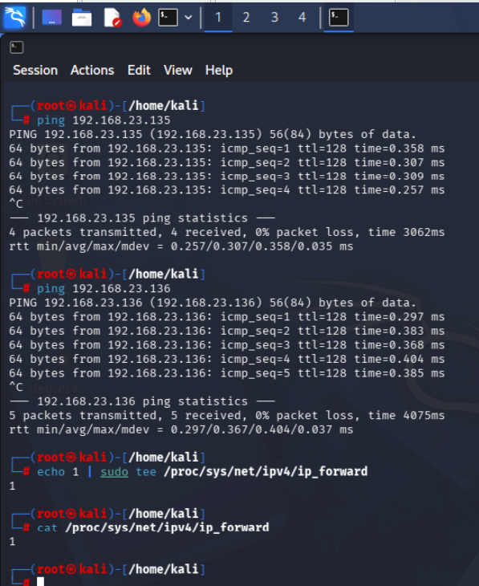
> Value confirmed as `1` — forwarding active

---

### Step 4 — Record Baseline ARP Tables

Document the correct ARP state before poisoning for comparison.

**Win7 ARP Table — Before**
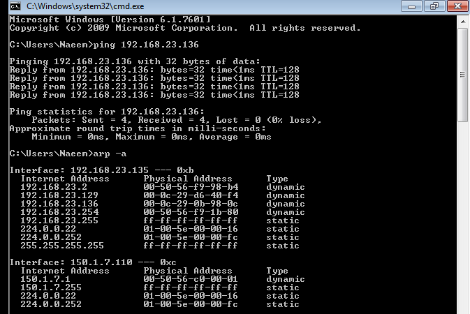
> Legitimate MAC addresses mapped correctly

**Kali ARP Table — Before**
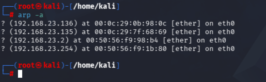

---

### Step 5 — Launch Ettercap & Scan Hosts

```bash
ettercap -G
```

Launch Ettercap GUI, set interface to **eth0**, enable **Unified Sniffing**.


> Ettercap 0.8.4 started — Unified sniffing on eth0

Run host scan → Hosts → Scan for Hosts → Hosts List

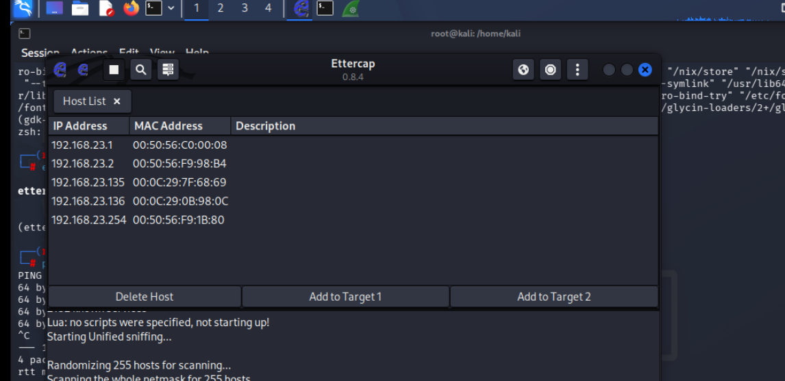
> 5 hosts discovered on the network

---

### Step 6 — Assign Targets

- Select `192.168.23.135` → **Add to Target 1**
- Select `192.168.23.136` → **Add to Target 2**

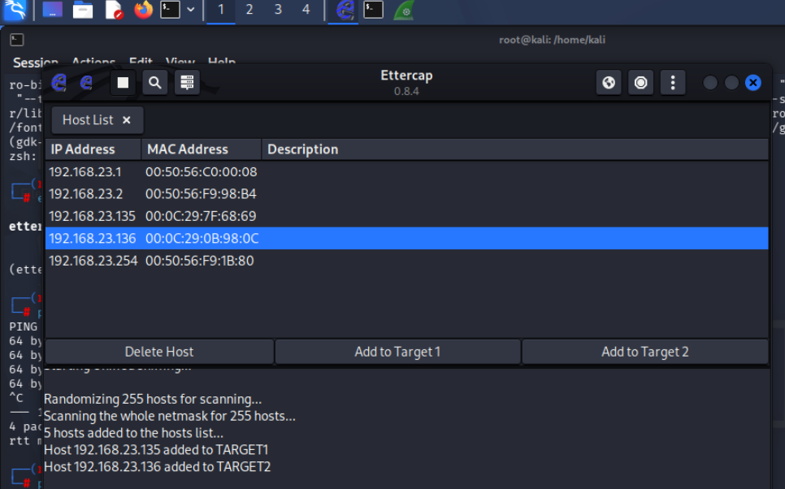
> Win7 → Target 1 | Win10 → Target 2

Then: **MITM → ARP Poisoning → OK** → Start Sniffing

---

### Step 7 — Verify ARP Cache Poisoning

After the attack starts, check ARP tables on both victims.

**Win7 ARP Table — AFTER (Poisoned)**
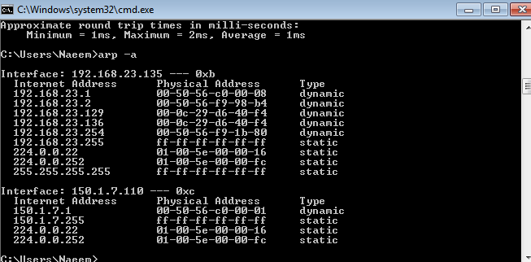
> ⚠️ Win10's IP (`192.168.23.136`) now maps to **Attacker's MAC** `00:0C:29:D6:40:F4`

**Win10 ARP Table — AFTER (Poisoned)**
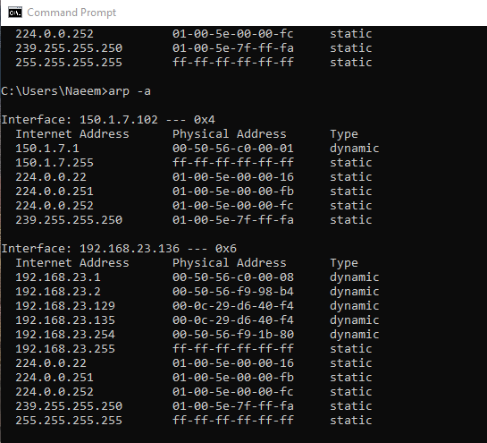
> ⚠️ Win7's IP (`192.168.23.135`) now maps to **Attacker's MAC** — poison confirmed ✅

---

## ✅ Results & Verification

### Wireshark — ICMP Traffic Intercepted
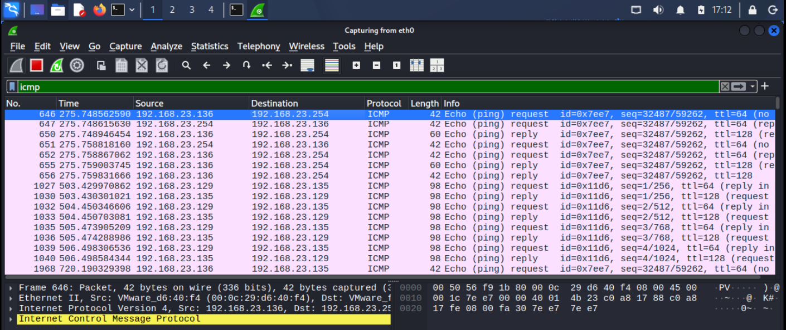
> ICMP packets between `.135` and `.136` are now **visible on Kali** — full interception confirmed

### Wireshark — Forged ARP Replies
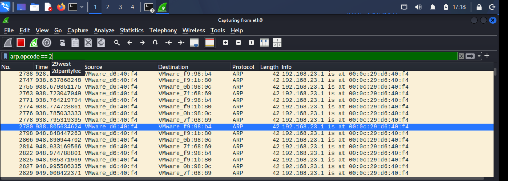
> Wireshark filter `arp.opcode == 2` shows continuous forged ARP replies being sent by attacker

### Wireshark — Duplicate IP Detected
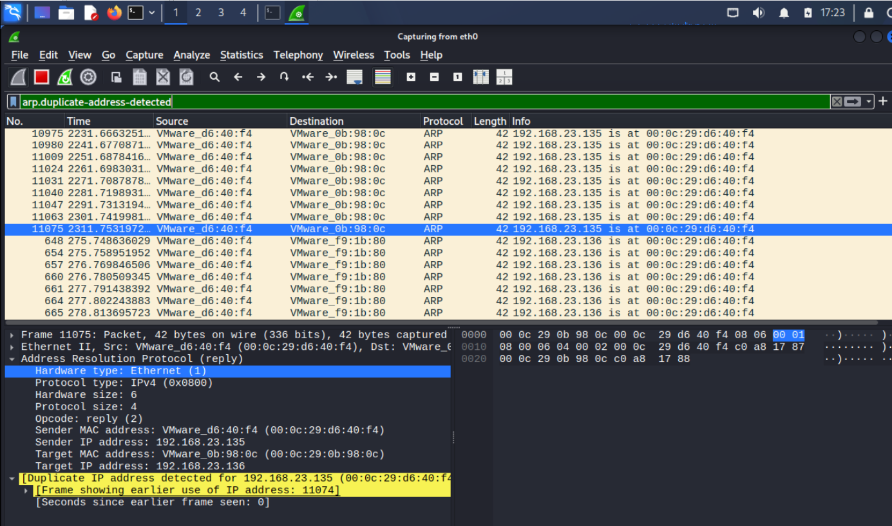
> `arp.duplicate-address-detected` — Wireshark confirms the ARP conflict caused by poisoning

---

## 🛡️ Mitigation

| Technique | Description |
|-----------|-------------|
| **Dynamic ARP Inspection (DAI)** | Switch validates ARP against DHCP snooping binding table — drops spoofed entries |
| **Static ARP entries** | Manually pin MAC-to-IP for critical hosts — cannot be overwritten |
| **Traffic encryption (TLS/VPN)** | Even if intercepted, data is unreadable |
| **VLAN segmentation** | Limits which hosts can receive each other's ARP broadcasts |
| **XArp / ARP monitoring** | Detects duplicate IP-MAC mappings in real time |

---

<div align="center">

← [Back to Main README](../README.md) | [DHCP Spoofing →](../dhcp-spoofing/README.md)

</div>
