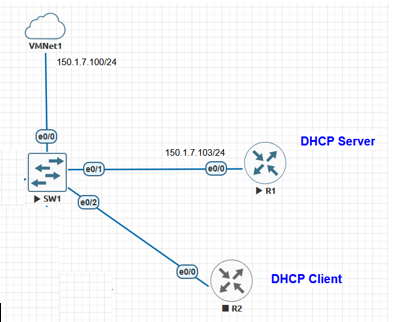
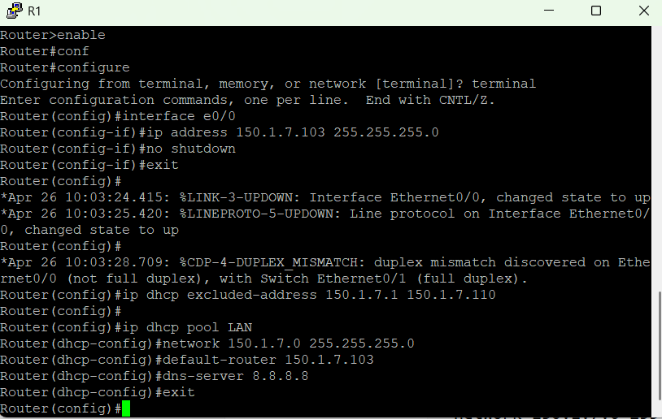
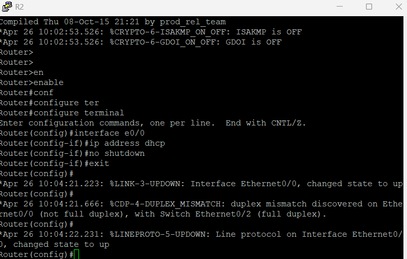
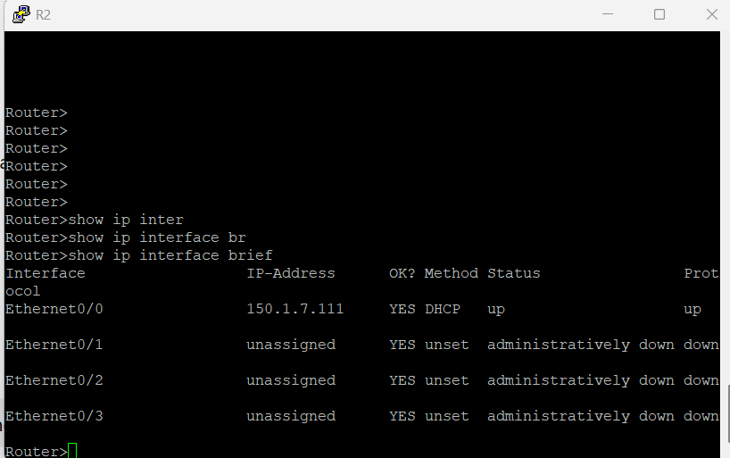
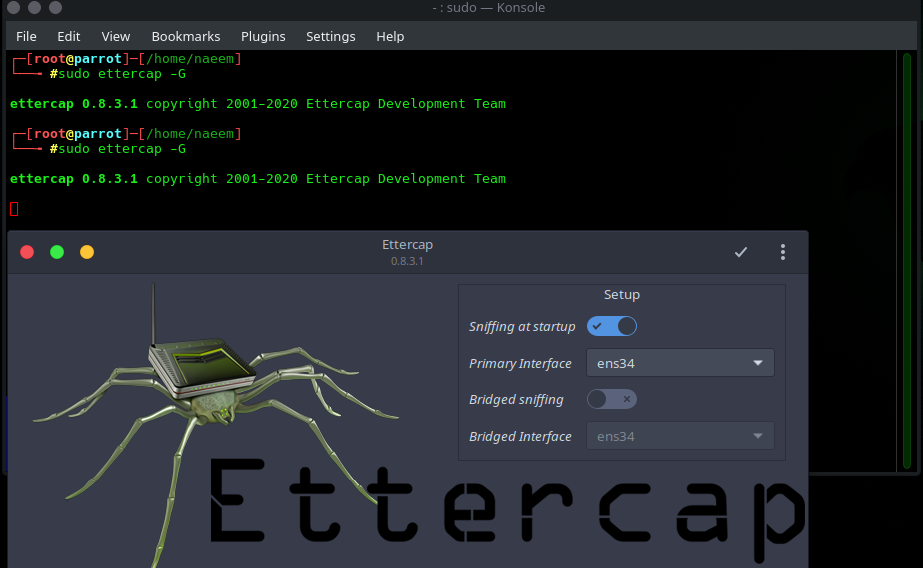
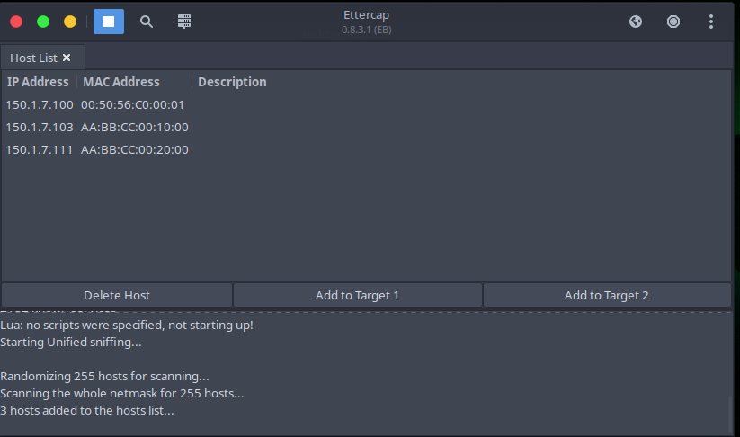
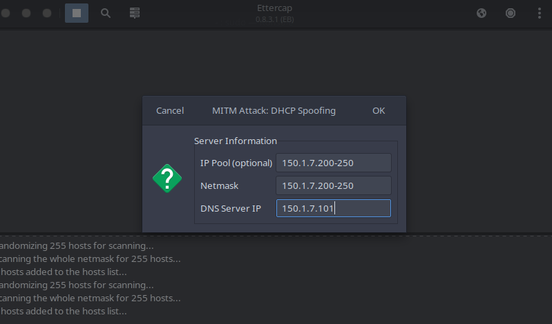
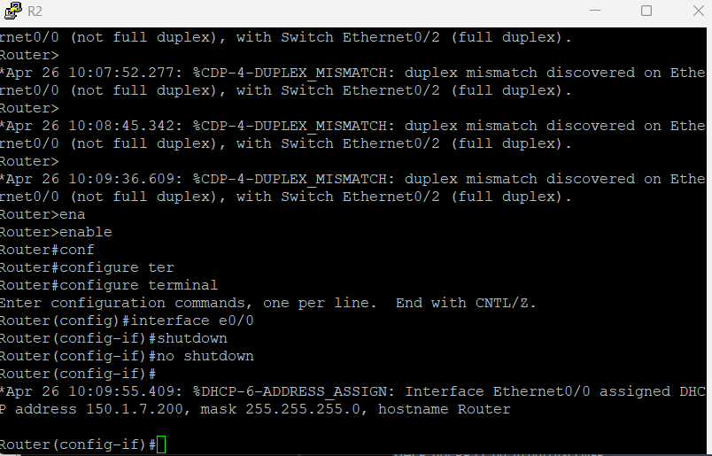
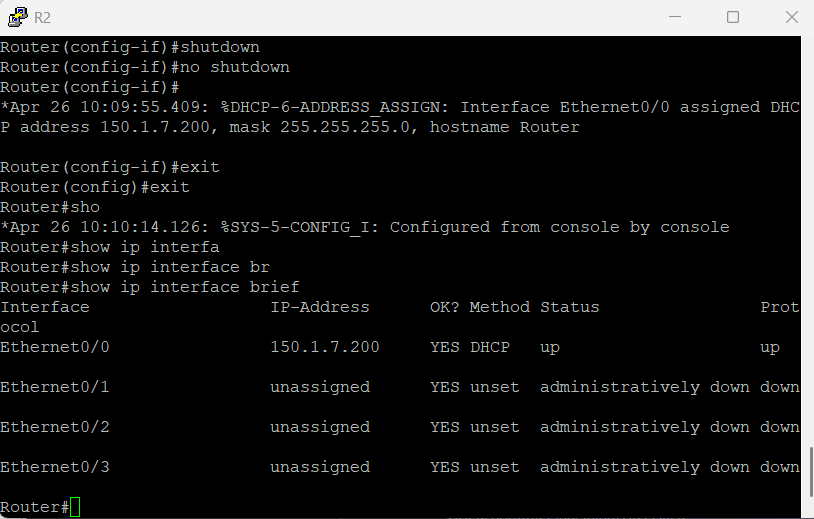
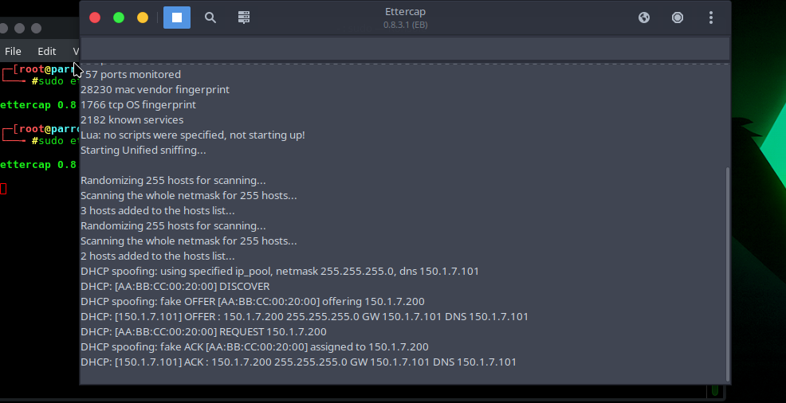

<div align="center">

# ⚡ DHCP Spoofing Attack

[](https://www.parrotsec.org/)
[](https://www.ettercap-project.org/)
[](https://www.gns3.com/)
[]()

<br/>

> Impersonate a legitimate DHCP server to assign a rogue gateway and DNS to network clients — silently redirecting all their traffic.

</div>

---

## 📋 Table of Contents
- [How DHCP Spoofing Works](#-how-dhcp-spoofing-works)
- [Lab Setup](#-lab-setup)
- [Network Topology](#-network-topology)
- [Step-by-Step Walkthrough](#-step-by-step-walkthrough)
- [Results & Verification](#-results--verification)
- [Mitigation](#-mitigation)

---

## 🧠 How DHCP Spoofing Works

```
NORMAL DHCP FLOW:
  Client (R2) ──DISCOVER──► Legitimate Server (R1)
  Client (R2) ◄──OFFER────  R1 assigns: 150.1.7.111

DHCP SPOOFING FLOW:
  Client (R2) ──DISCOVER──► Legitimate Server (R1)  [ignored]
                         └──► Attacker (Ettercap)   [WINS RACE]
  Client (R2) ◄──fake OFFER── Attacker assigns: 150.1.7.200
                               Gateway: Attacker IP
                               DNS: Attacker IP
```

The attacker's Ettercap **responds faster** than the real DHCP server. The client accepts whichever OFFER arrives first — so the attacker wins the race and becomes the client's gateway and DNS resolver.

---

## 🖥️ Lab Setup

| Role | Device | IP | Platform |
|------|--------|----|---------|
| **Legitimate DHCP Server** | R1 (GNS3 Router) | `150.1.7.103/24` | Cisco IOS (GNS3) |
| **DHCP Client** | R2 (GNS3 Router) | Dynamic | Cisco IOS (GNS3) |
| **VMNet Gateway** | VMNet1 | `150.1.7.100/24` | VMware |
| **Attacker** | Parrot OS | `ens34` | Parrot OS + Ettercap 0.8.3.1 |
| **Rogue Pool** | — | `150.1.7.200-250` | — |
| **Rogue DNS/GW** | — | `150.1.7.101` | — |

---

## 🗺️ Network Topology


> GNS3 topology: VMNet1 → SW1 → R1 (DHCP Server) and R2 (DHCP Client) on network `150.1.7.0/24`

---

## 🚀 Step-by-Step Walkthrough

### Step 1 — Configure R1 as Legitimate DHCP Server

```cisco
Router(config)# interface e0/0
Router(config-if)# ip address 150.1.7.103 255.255.255.0
Router(config-if)# no shutdown
Router(config)# ip dhcp excluded-address 150.1.7.1 150.1.7.110
Router(config)# ip dhcp pool LAN
Router(dhcp-config)# network 150.1.7.0 255.255.255.0
Router(dhcp-config)# default-router 150.1.7.103
Router(dhcp-config)# dns-server 8.8.8.8
```


> R1 configured as DHCP server with pool `150.1.7.0/24`, gateway `.103`, DNS `8.8.8.8`

---

### Step 2 — Configure R2 as DHCP Client

```cisco
Router(config)# interface e0/0
Router(config-if)# ip address dhcp
Router(config-if)# no shutdown
```



**R2 receives legitimate IP from R1**


> `show ip interface brief` — R2 gets `150.1.7.111` via DHCP from R1 ✅

---

### Step 3 — Launch Ettercap on Parrot OS

```bash
sudo ettercap -G
```

Set interface to **ens34** → Enable Unified Sniffing


> Ettercap 0.8.3.1 launched on Parrot OS — interface ens34

---

### Step 4 — Scan Hosts

Run host scan → Hosts → Scan for Hosts → Host List


> 3 hosts found: `150.1.7.100` (VMNet1), `150.1.7.103` (R1 DHCP Server), `150.1.7.111` (R2 Client)

---

### Step 5 — Configure DHCP Spoofing Plugin

MITM → DHCP Spoofing → Configure:

```
IP Pool:      150.1.7.200-250
Netmask:      255.255.255.0
DNS Server:   150.1.7.101   ← attacker's IP
```


> Rogue DHCP pool set — attacker will serve IPs from `150.1.7.200-250` with itself as DNS

Click **OK** → attack starts listening for DISCOVER packets.

---

### Step 6 — Trigger DHCP Renewal on R2

Force R2 to send a new DHCP DISCOVER by cycling its interface:

```cisco
Router(config)# interface e0/0
Router(config-if)# shutdown
Router(config-if)# no shutdown
```


> Interface cycled — R2 broadcasts a fresh DHCP DISCOVER

---

## ✅ Results & Verification

### R2 Receives Rogue IP from Attacker


> ⚠️ `show ip interface brief` — R2 now has `150.1.7.200` via **DHCP from attacker** (Method: DHCP) — **attack successful ✅**

### Ettercap DHCP Exchange Log



```
DHCP: [AA:BB:CC:00:20:00] DISCOVER
DHCP spoofing: fake OFFER [AA:BB:CC:00:20:00] offering 150.1.7.200
DHCP: [150.1.7.101] OFFER : 150.1.7.200 GW 150.1.7.101 DNS 150.1.7.101
DHCP: [AA:BB:CC:00:20:00] REQUEST 150.1.7.200
DHCP spoofing: fake ACK [AA:BB:CC:00:20:00] assigned to 150.1.7.200
```

> Full DORA cycle intercepted — DISCOVER → fake OFFER → REQUEST → fake ACK ✅

---

## 🛡️ Mitigation

| Technique | Description |
|-----------|-------------|
| **DHCP Snooping** | Allows DHCP replies only from trusted (uplink) ports — blocks rogue servers |
| **802.1X Port Authentication** | Unauthorized devices cannot connect to the network |
| **Static IP for Critical Devices** | Routers/servers never use DHCP — immune to spoofing |
| **IDS/IPS Monitoring** | Detects multiple DHCP OFFER packets from unknown MACs |
| **VLAN Isolation** | Confines DHCP traffic to specific segments |

---

<div align="center">

← [ARP Poisoning](../arp-poisoning-mitm/README.md) | [Back to Main README](../README.md)

</div>
